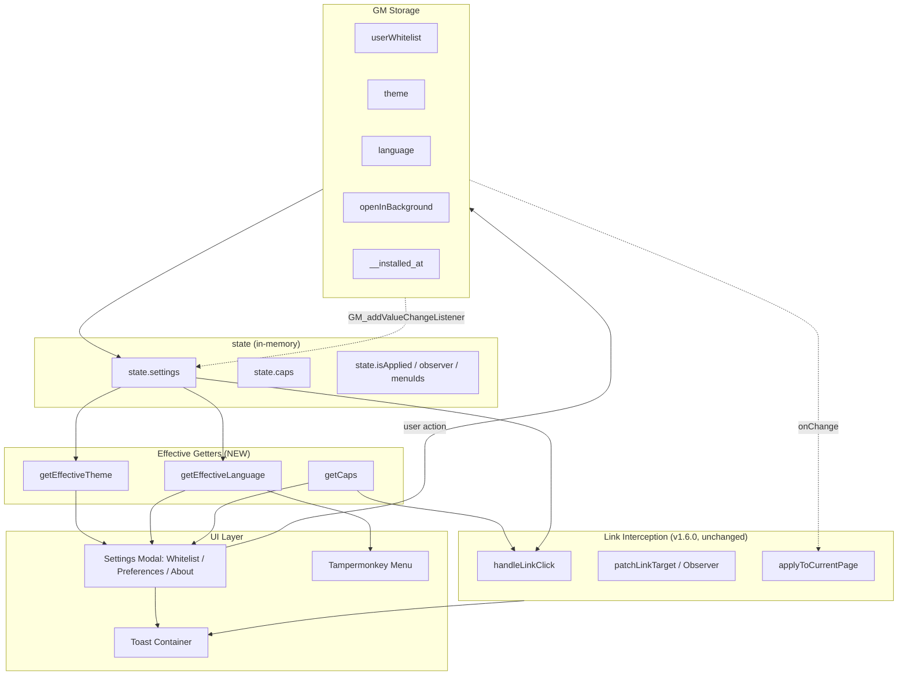

## 产品概述

为油猴脚本 `Open In New Tab` 发布 v1.7.0（P1 阶段），把扩展端"设置中心"的核心能力首次系统性地搬到脚本端，让脚本从"白名单管理器"升级为完整的"设置中心 + 链接拦截器"。本次只动脚本 + 三处文档 + 版本号，不改扩展运行时逻辑。

## 核心功能

- **JSON 白名单 导入 / 导出**：从模态框一键导出（`open-in-new-tab-whitelist-YYYYMMDD.json`，带 schema 版本号），一键导入并支持"合并去重"或"覆盖"两种策略，无效条目静默丢弃并汇总提示。
- **主题手动覆盖**：模态框内 radio（auto / light / dark），存 `theme` key，立即重渲染模态自身配色，不影响宿主页面。
- **语言手动覆盖**：模态框内 radio（auto / 英文 / 中文），存 `language` key，立即重渲染所有可见 UI 文案。
- **Toast 通知**：自研非阻塞 toast（success / info / error 三型，右上角堆叠，最多同屏 3 条，3s 自动消失，CSS transition 渐隐），全量替换 4 处阻塞式 `alert`。
- **后台打开（实验性）**：基于 `GM_openInTab({ active: false })`，feature-detect；checkbox 标记"实验性"，TM 缺失时 disabled + tooltip；默认关，不改变老用户行为。
- **欢迎页**：首次安装检测（`__installed_at` + `userWhitelist` 双哨兵，避免老用户升级被打扰），命中则 `GM_openInTab` 打开官网欢迎页，能力不可用时降级为长 toast 引导。
- **菜单升级**：把"管理白名单"改名为"打开设置"，指向同一个升级版多 section 模态框（Whitelist / Preferences / About）。
- **文档同步**：README "Known Differences" 表格更新为本次新增能力的对齐状态；TODO.md 把 6 项 P1 整体迁入 Done。

## Tech Stack

- **运行时**：单文件 IIFE 油猴脚本，纯 DOM + GM API，零外部依赖（与现有 v1.6.1 保持一致）
- **存储**：Tampermonkey GM Storage（`GM_setValue` / `GM_getValue`，跨 tab 通过已接入的 `GM_addValueChangeListener` 同步）
- **UI**：原生 DOM + 内联 `cssText` + 类前缀 `oint-`（沿用现有 `openinnewtabs-` 风格，新增组件统一用更短的 `oint-` 前缀以收敛命名）
- **国际化**：内置 `languageResources` 字典（en / zh），通过新增的 `getEffectiveLanguage()` 单一入口读取
- **主题**：复用 `getThemeColors()`，内部改读 `getEffectiveTheme()`
- **构建工具**：无（纯 `.user.js`，发布即可用）；版本同步走既有 `scripts/sync-version.mjs`
- **静态检查**：`npm run lint`（ESLint flat config，已含 `globals.greasemonkey`）、`npm run version:verify`

## Implementation Approach

**策略**：单文件分层重构，新增"设置层"切面，旧"链接拦截层"原样复用。

**关键决策**：

1. **抽象层先行**：在改 UI 之前先落地 `state.settings` + 三个 effective getter（`getEffectiveTheme` / `getEffectiveLanguage` / `getCaps`），所有现有调用点（`getThemeColors` / `getText` / `handleLinkClick`）只换数据源、不改语义。这样 UI 即使没接好，行为也已切换到"可由用户覆盖"的轨道，回滚干净。
2. **模态框 Section 化**：保留单 modal 结构，内部按 Whitelist / Preferences / About 三段顺序排版（不做 tab 切换，避免引入路由状态）；section 切换通过 `scrollIntoView` 即可，符合"小工具不上框架"的项目原则。
3. **重渲染收敛到一个函数**：所有"主题切换 / 语言切换 / 白名单变化 / 设置变化"统一调用 `rerenderModal()`，内部根据 `modal.style.display` 决定是否重建内容；避免分散在多个回调里维护片段更新。
4. **后台打开走同步分支**：在 `handleLinkClick` 内部用 `if (caps.canOpenInTab && settings.openInBackground) GM_openInTab(...) else window.open(...)`，**不能引入任何 `await`**，否则破坏用户手势栈、被弹窗拦截器拦截。
5. **首次安装哨兵双因子**：单看 `__installed_at` 会把 v1.6.x 老用户当首次；引入 `userWhitelist.length > 0` 作为副因子——`__installed_at` 缺失但白名单非空 → 老用户，仅补写时间戳不弹欢迎页。
6. **导入冲突处理用原生 `confirm`**：modal-in-modal 是反模式；原生 `confirm("Merge or Replace?")` 一次决策即可，符合"克制工程"。
7. **Toast 单例容器**：避免每条 toast 都 attach/detach 父节点；容器在 `document.body` 出现后懒创建一次，后续 toast 共享。

**性能与可靠性**：

- 抽象层 getter 是 O(1) 同步读 + 内存缓存（`state.settings` 在 init 时一次性读全，后续靠 storage listener 增量更新），热路径 `handleLinkClick` 不查 GM 存储。
- 模态框 rerender 仅在用户可见时执行，不可见态零开销。
- Toast 队列硬上限 3 条，超出时旧的提前进入淡出阶段，杜绝堆积。

**避免技术债**：

- 不引入 CSS 文件 / 框架 / 构建步骤（保持 P2 才解决"shared/core 抽包"）。
- 不复用扩展 `options.js`（扩展走 `chrome.storage`，跨端 API 差异大，复制成本 > 复用价值）；MIRROR 注释只保留在 v1.6.0 已建立的核心拦截路径上。

## Implementation Notes

- **Grounded**：复用现有 `state` 对象（v1.6.0 已建立），扩展为 `state.settings` 与 `state.caps`；Toast 容器类名 `oint-toast-container`，单 toast 类 `oint-toast oint-toast--{type}`，与既有 `openinnewtabs-modal*` 共存不冲突。
- **Performance**：① `handleLinkClick` 保持完全同步，新分支只是分支判断；② `setupStorageListener` 监听新增的 `theme` / `language` / `openInBackground` 三个 key，回调里仅更新 `state.settings` 并调用 `rerenderModal()`，不重新跑 `applyToCurrentPage`（这些设置不影响白名单匹配）；③ 模态框重渲染用 innerHTML 一次性替换 body，避免逐节点 diff。
- **Logging**：沿用 v1.6.0 的 `console.warn("[OpenInNewTab] ...")` 格式；新增的 storage 失败、JSON parse 失败、`GM_openInTab` 抛错都走 `console.warn` + 一条 error toast，不打印用户白名单内容（隐私保护）。
- **Blast radius**：① 后台打开默认 `false`，老用户行为零变化；② 欢迎页有双因子哨兵，老用户升级不打扰；③ 模态 DOM 全部用 `oint-`/`openinnewtabs-` 前缀，类名隔离；④ 单文件改动，`git revert` 一键回滚；⑤ 不动扩展运行时代码，扩展用户完全不受影响。

## Architecture Design

本次属于既有项目内增量扩展，沿用 v1.6.0 已有架构（IIFE + 模块状态 + 幂等挂卸 + 存储监听），不引入新模式。



## Directory Structure

### Directory Structure Summary

本次改动集中在脚本主体单文件 + 版本同步触达的几处。无新增目录，无新增源文件。

```
OpenInNewTab/
├── userscript/
│   ├── OpenInNewTab.user.js   # [MODIFY] 主改动文件（约 +400 / -50 行）
│   │                          #  新增：state.settings/state.caps、三 effective getter、
│   │                          #  toast 模块（容器+队列+showToast API）、
│   │                          #  Settings 模态重构（Whitelist + Preferences + About 三段）、
│   │                          #  JSON import/export（带 schema 版本号、合并/覆盖确认）、
│   │                          #  GM_openInTab 后台打开分支接入 handleLinkClick、
│   │                          #  欢迎页首次运行哨兵（双因子：__installed_at + userWhitelist.length）、
│   │                          #  i18n 字典扩展约 20 个 key × 2 语言、
│   │                          #  metadata 加 @grant GM_openInTab。
│   │                          #  约束：handleLinkClick 保持同步；模态 rerender 单入口；类名沿用 oint-/openinnewtabs- 前缀。
│   ├── README.md              # [MODIFY] 更新「Known Differences from the Extension」表格：
│   │                          #  - Background open: ❌ → ✅ (experimental, TM only)
│   │                          #  - Theme/Language manual override: ❌ → ✅
│   │                          #  - JSON whitelist import/export: ❌ → ✅
│   │                          #  - Welcome/onboarding: ❌ → ✅ (degraded toast on legacy managers)
│   └── README.zh-CN.md        # [MODIFY] 中文版同步上述表格变更
├── extension/
│   └── manifest.json          # [MODIFY] version: 1.6.1 → 1.7.0（minor bump，单一事实源）
├── website/
│   ├── index.html             # [MODIFY] <meta name="app-version"> 由 sync-version.mjs 自动更新
│   └── privacy-policy.html    # [MODIFY] 同上，自动更新
└── TODO.md                    # [MODIFY] 把 P1（脚本设置中心对齐扩展）6 项整体迁移到 ✅Done 区段
```

## Key Code Structures

### 设置存储 schema（GM Storage 新增 key）

```
theme:             "auto" | "light" | "dark"   default "auto"
language:          "auto" | "en" | "zh"        default "auto"
openInBackground:  boolean                      default false
__installed_at:    number (ms timestamp)        absent => first-run candidate
```

### Effective Getter 接口契约

```
getEffectiveTheme():    "light" | "dark"      // 解析 auto -> matchMedia 结果
getEffectiveLanguage(): "en" | "zh"           // 解析 auto -> navigator.language 派生
getCaps():              { canUnregisterMenu, canListenStorage, canOpenInTab }
```

### JSON 导出 payload schema

```
{
  "version": 1,
  "exportedAt": "<ISO 8601 string>",
  "domains": ["example.com", "github.com", ...]
}
```

导入端兼容三种输入：上述对象、纯 `string[]`、未来扩展端导出格式（保留兜底分支）。

## Agent Extensions

### SubAgent

- **code-explorer**
- Purpose: 在实施前快速定位脚本中模态框 UI 区段的精确行号区间、所有 `alert()` 调用点、`getThemeColors` / `getText` / `detectLanguage` / `isDarkMode` 当前所有调用方，以及官网欢迎页 URL（`website/index.html`）的 canonical 路径。
- Expected outcome: 产出一份精确的"修改坐标清单"，确保模态重构与 toast 替换不漏点、不误伤 v1.6.0 的链接拦截核心路径。