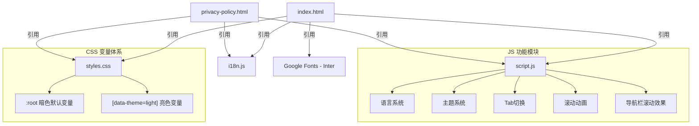

## 用户需求

用户对当前 Open In New Tab 项目官网整体样式极度不满，要求彻底重构。参考目标为 cursor.com 和 vercel.com，追求现代、美观、大方、极具科技感的视觉效果。

## 产品概述

将 Open In New Tab 官网从当前传统绿色+紫色渐变的普通风格，彻底重构为以深色为主基调、极简科技感的现代官网。整体视觉对标 Cursor / Vercel 级别的高端设计语言，保留所有现有功能（i18n 国际化、主题切换、语言切换、安装引导、版本对比等）。

## 核心特征

- **深色为主基调的全新视觉体系**：以纯黑/深灰为主背景，白色文字，少量蓝紫色渐变光晕作为品牌点缀色
- **巨型标题排版的 Hero 区域**：超大字号标题 + 渐变文字效果 + 大量留白，营造视觉冲击力
- **毛玻璃透明导航栏**：深色半透明 + backdrop-filter 模糊效果，紧凑布局，SVG 图标替代 emoji
- **深色卡片设计体系**：深色背景 + 半透明微边框(rgba白色)替代白底+阴影，hover 时边框发光
- **SVG 图标替代所有 emoji**：Features 区使用精致的 SVG 线条图标，专业感更强
- **精致微动画**：滚动渐入、卡片 hover 微光效果、按钮 hover 上浮
- **保留全部功能**：i18n 系统(data-i18n 属性)、暗色/亮色主题切换、语言切换、Tab 安装引导、所有外部链接

## 技术栈

- HTML5 / CSS3 / Vanilla JavaScript（保持原项目纯静态技术栈不变）
- 字体：引入 Inter（Google Fonts），对标 Cursor/Vercel 的现代无衬线字体
- 图标：内联 SVG 替代所有 emoji，保持零外部依赖
- 部署：Vercel 静态部署（vercel.json 已有配置，无需变更）

## 实现方案

### 整体策略

对 `index.html`、`styles.css`、`script.js` 三个文件进行彻底重写，`i18n.js` 微调（更新 emoji 相关翻译文本为纯文字版本）。设计语言从"绿色系传统网站"全面转向"深色系极简科技感"。

### 核心设计决策

**1. 色彩体系翻转**

- 抛弃绿色(#4caf50)主色调和紫色渐变hero背景
- 暗色模式为默认主模式：背景 #0a0a0a，卡片 #111，边框 rgba(255,255,255,0.08)
- 品牌色：蓝紫渐变 (#7c3aed -> #2563eb) 仅用于强调元素（CTA按钮、高亮文字、光晕）
- 亮色模式保留但作为次要选项：背景 #fafafa，卡片 #fff，边框 rgba(0,0,0,0.08)

**2. 排版体系**

- 引入 Inter 字体（通过 Google Fonts CDN）
- Hero 标题：4.5rem~5rem，font-weight 700，letter-spacing: -0.03em（紧凑现代感）
- 高亮文字使用 background-clip 蓝紫渐变效果
- body 文字 1rem，行高 1.7，颜色使用半透明白色(rgba(255,255,255,0.6))

**3. 导航栏重构**

- 深色半透明背景 rgba(10,10,10,0.8) + backdrop-filter: blur(20px)
- 底部 1px 半透明边框替代 box-shadow
- 高度压缩至 56px
- GitHub 按钮使用真实 SVG GitHub 图标 + 白底黑字按钮
- 语言切换器和主题切换器尺寸缩小，风格统一

**4. Hero 区域**

- 纯黑背景 + 顶部蓝紫色径向渐变光晕(radial-gradient)，营造科技感氛围
- 超大标题居中，关键词用渐变色
- 徽章改为深色底+半透明边框胶囊样式
- 去掉badge中的emoji，用纯文字标签

**5. 卡片体系（Features/Versions/Install）**

- 深色背景(#111) + 1px solid rgba(255,255,255,0.08) 边框
- hover 时边框变亮 rgba(255,255,255,0.15) + 微弱 box-shadow 发光
- SVG 线条图标替代 emoji 图标
- 圆角统一为 12px

**6. 安装引导区**

- 步骤数字改为渐变背景圆形
- Tab 按钮改为深色底+半透明边框，active 状态使用品牌渐变色

**7. CTA 区域**

- 去掉紫色渐变背景，改为带微弱径向光晕的深黑色背景
- 按钮使用白色填充（主按钮）和透明描边（次按钮）

**8. Footer**

- 极简深色，文字使用 rgba(255,255,255,0.4) 低调显示
- 去掉三栏网格，简化为单行或两行紧凑布局

## 实现注意事项

- **i18n 兼容性**：所有 `data-i18n` 属性必须保留且 key 值不变，仅在 i18n.js 中移除 emoji 前缀（如 "✨ Dark Mode" -> "Dark Mode"）
- **主题切换兼容**：CSS 变量体系完整覆盖暗/亮两套主题，暗色为默认
- **script.js 兼容**：保留所有 class 名称选择器（`.install-tab`、`.install-panel`、`.lang-dropdown-btn`、`.lang-option`、`#themeToggle` 等），确保 JS 交互功能不受影响
- **privacy-policy.html**：同步更新 nav 结构和样式引用，确保两个页面视觉一致
- **性能**：Inter 字体使用 `display=swap` 防止 FOIT；SVG 内联而非外部文件；CSS 动画使用 transform/opacity 而非触发 layout 的属性
- **滚动动画**：保留 IntersectionObserver 方案但更新选择器匹配新 class

## 架构设计



## 目录结构

```
website/
├── index.html              # [MODIFY] 彻底重写HTML结构。引入Inter字体CDN，重构nav为紧凑毛玻璃导航栏（SVG GitHub图标替代emoji），重写Hero区为大标题+渐变光晕+深色徽章，Features用SVG图标替代emoji卡片，Versions/Install/CTA/Footer全部重构为深色体系布局。保留所有data-i18n属性和功能性id/class。
├── styles.css              # [MODIFY] 完全重写样式。CSS变量翻转为暗色默认+亮色切换，全新色彩/排版/间距体系，毛玻璃nav，深色卡片+半透明边框，渐变按钮，径向光晕背景，精致hover动画，完整响应式适配。
├── script.js               # [MODIFY] 适配新HTML结构。更新initNavbarScroll（边框透明度变化替代box-shadow），更新initScrollAnimations（匹配新class选择器），主题系统默认暗色，其余功能逻辑保持不变。
├── i18n.js                 # [MODIFY] 微调翻译文本。去除badge/tab/note中的emoji前缀（如 "✨ Dark Mode" -> "Dark Mode"），保持所有key不变。
├── privacy-policy.html     # [MODIFY] 同步更新nav结构和hero样式，确保与index.html导航一致。
├── icon16.png              # [不变]
├── icon24.png              # [不变]
├── package.json            # [不变]
└── vercel.json             # [不变] (在上级目录)
```

## 设计风格

对标 Cursor.com 和 Vercel.com 的极简科技感设计语言，以纯黑深色为主基调，大量留白，高对比度排版，蓝紫渐变色作为品牌点缀。整体氛围冷静、克制、高级。

## 全局基调

- 背景：纯黑(#0a0a0a) 为主背景色，深灰(#111) 为卡片/容器色
- 文字：白色(#fff)标题 + 半透明白色(rgba 255,255,255,0.6) 正文
- 点缀：蓝紫渐变(#7c3aed - #2563eb) 用于CTA按钮文字高亮和光晕
- 边框：rgba(255,255,255,0.08) 超微弱线条分隔
- 无阴影设计：不使用 box-shadow 而用边框亮度变化表示层级

## 页面设计

### 1. 导航栏 (Nav)

- 固定顶部，高度 56px
- 背景：rgba(10,10,10,0.8) + backdrop-filter: blur(20px)
- 底部 1px solid rgba(255,255,255,0.06) 分隔线
- 左侧：图标(24px) + "Open In New Tab" 白色加粗文字
- 中间偏右：Features / Versions / Installation 链接，灰白色文字，hover 变白
- 右侧紧凑排列：语言切换(小型下拉) | 主题切换(小号toggle) | GitHub 按钮(SVG图标+白底黑字圆角按钮)
- 分隔线将导航链接和控件组分开

### 2. Hero 区域

- 最小高度 100vh，纯黑背景
- 顶部中心放置一个大型蓝紫色径向渐变光晕 (radial-gradient, 50% 0%, 半径800px, 透明度0.15)
- 内容居中，最大宽度 800px
- 标题：第一行 "Smart Link Management" 白色 4.5rem 700weight
- 第二行 "Your Way" 蓝紫渐变色 background-clip text
- 副标题：rgba(255,255,255,0.5) 1.125rem，两行
- 按钮组：主按钮(白底黑字,圆角8px,hover微上浮) + 次按钮(透明底+白色描边+白色文字,hover边框变亮)
- 底部徽章：深色胶囊标签 rgba(255,255,255,0.06)底色 + rgba(255,255,255,0.1)边框，纯文字无emoji

### 3. Features 区域

- 纯黑背景，上下 padding 120px
- 标题 2.5rem 居中白色，副标题半透明白色
- 3列网格(响应式收缩)，gap 24px
- 每个卡片：背景 #111，1px solid rgba(255,255,255,0.08) 边框，圆角 12px，padding 32px
- 顶部 SVG 图标(32x32, stroke 风格, 蓝紫渐变色)
- 标题白色 1.125rem 600weight，描述半透明白色 0.9rem
- hover：边框变亮至 rgba(255,255,255,0.15)，微弱上移 translateY(-2px)

### 4. Versions 区域

- 深黑背景，两列卡片
- 推荐卡片(Chrome Extension)：边框使用蓝紫渐变色 1px，推荐badge使用渐变背景白色文字
- 普通卡片：标准半透明边框
- 功能列表项前使用蓝紫色小对勾SVG替代文字 "✓"
- 对比表格：深色背景，行 hover 变亮，表头半透明分隔

### 5. 安装引导区

- 交替深色背景(稍亮 #0f0f0f)
- Tab 按钮：深色底+半透明边框，active 状态渐变背景+白色文字
- 步骤卡片：深色卡片，步骤数字使用蓝紫渐变圆形
- 代码块/提示：更深色背景(#0a0a0a)，左侧蓝紫色边线

### 6. CTA 区域

- 纯黑背景 + 中心淡蓝紫径向光晕(同Hero但更淡)
- 大标题白色，副标题半透明白色
- 按钮样式同Hero区

### 7. Footer

- 最深色背景(#050505) + 顶部 1px 分隔线
- 三栏布局，文字极低透明度(0.4)
- 链接 hover 变白
- 底部版权信息居中，更低透明度(0.3)

## Agent Extensions

### SubAgent

- **code-explorer**
- Purpose: 在重构过程中搜索验证 data-i18n key 的完整性，确保 i18n.js 和 HTML 中的 key 完全匹配
- Expected outcome: 确认所有翻译 key 在重构后不丢失，新 HTML 中的 data-i18n 属性与 i18n.js 翻译表一一对应